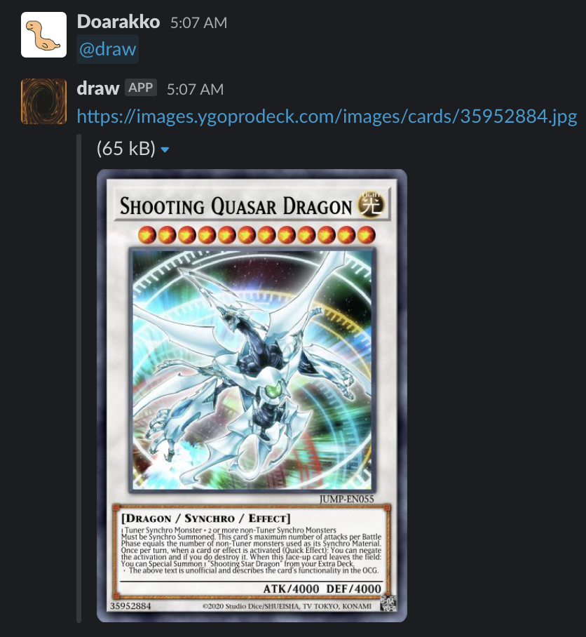

# draw-slack

Draw Yu-Gi-Oh! Card on Slack.

Since it uses the [Slack platform](https://api.slack.com/start/overview), there is no need to prepare an execution environment.



## Requirements

- Slack CLI

## Usage

1. Clone this repository.

    ```bash
    git clone https://github.com/Doarakko/draw-slack
    cd draw-slack
    ```

2. Enter your Slack channel ID in `triggers/trigger.ts`.

    ```typescript
    event: {
        event_type: TriggerEventTypes.AppMentioned,
            channel_ids: ["C059CTRJNVD"],
        },
    ```

    It does not work on channels not specified here.
    [Referece: [QUERY] How to listen on all channels or joined channels when create a event trigger like app_mentioned](https://github.com/slackapi/deno-slack-sdk/issues/222)

3. Deploy

    ```bash
    slack deploy
    ```

## Credits

- [Yu-Gi-Oh! API by YGOPRODeck](https://ygoprodeck.com/api-guide/)
